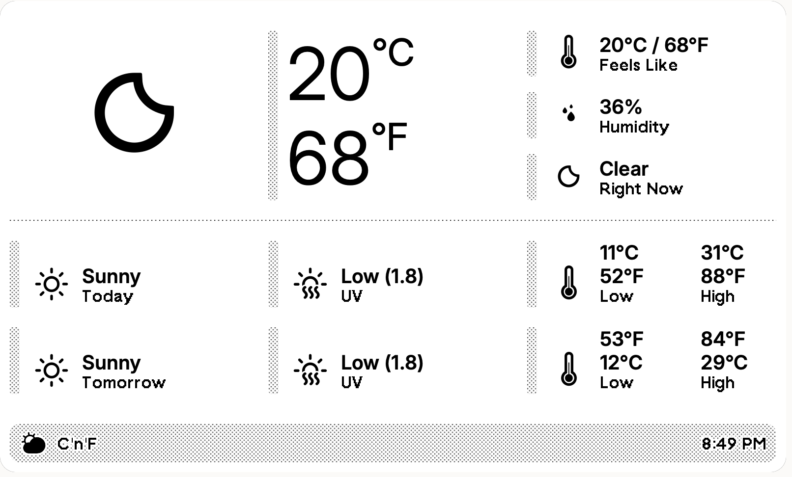
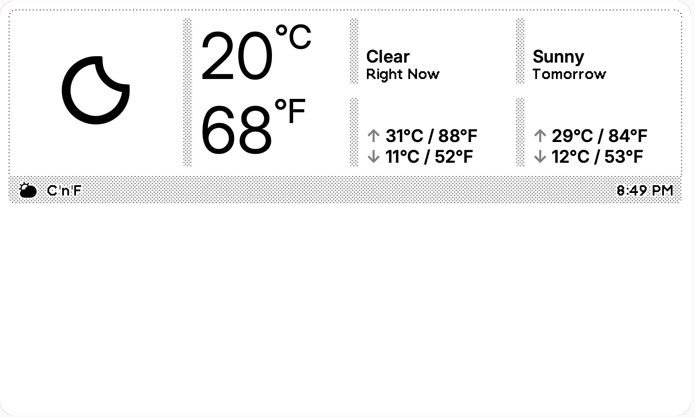
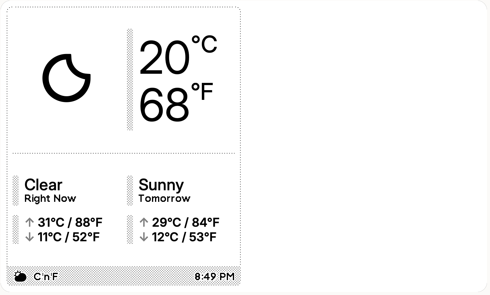
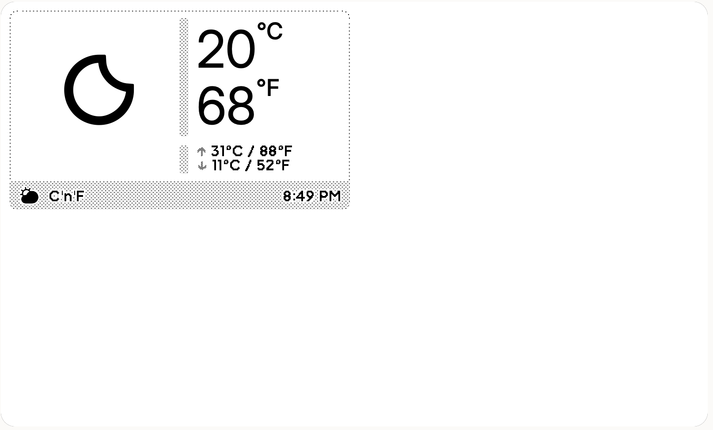

# TRMNL C°n°F Weather Plugin

**Celsius + Fahrenheit everywhere.**  
A clean, dual-unit weather widget for TRMNL using the native merged Weather plugin (WeatherAPI). Works perfectly on every layout size with zero external API calls.



### Features

- Celsius and Fahrenheit simultaneously
- Consistent branding & layout across **full**, **half vertical**, **half horizontal** and **quadrant**
- Uses TRMNL's free native data

---

## Setup Instructions (5 minutes)

1. Add, setup in Fahrenheit with WeatherAPI, the official **Weather** plugin to your TRMNL playlist and **hide it**. **This is important** because only plugins on a Playlist will sync fresh data. ([Official doc](https://docs.trmnl.com/go/private-api/plugin-data))
2. Go to **Private Plugins** → Create new → Choose **Plugin Merge** strategy.
3. Choose your layout size (full / half vertical / half horizontal / quadrant).
4. Paste the corresponding markup below into the editor.
5. Replace the weather plugin name variable `weather_12345` on top of each markup variant with your plugin name from variables found below the editor.
6. Save → force refresh your device.

---

## Markups

### 1. Full


```liquid


<div class="layout layout--col gap--space-between">
  <div class="grid grid--cols-6">
    <!-- Main weather icon (dynamic) -->
    <div class="row row--center col--span-2 portrait:col--span-6 col--end">
      
    </div>

    <!-- Current big temperature (F + C) -->
    <div class="col col--span-2 portrait:col--span-3 col--end">
      <div class="item grow">
        <div class="meta"></div>
        <div class="content">
          <span class="value value--xlarge lg:value--xxlarge" style="display: flex" data-fit-value="true">
            {{ w.temperature | minus: 32 | times: 0.5556 | round }}<span class="value value--medium">°C</span>
          </span>
          <span class="value value--xlarge lg:value--xxlarge" style="display: flex" data-fit-value="true">
            {{ w.temperature | round }}<span class="value value--medium">°F</span>
          </span>
        </div>
      </div>
    </div>

    <!-- Side panel: Feels Like, Humidity, Conditions -->
    <div class="col col--span-2 portrait:col--span-3 col--end gap--medium">
      <div class="item">
        <div class="meta"></div>
        <div class="icon">
          
        </div>
        <div class="content">
          <span class="value value--xsmall lg:value--large">
            {{ w.feels_like | minus: 32 | times: 0.5556 | round }}°C /
            {{ w.feels_like | round }}°F
          </span>
          <span class="label">Feels Like</span>
        </div>
      </div>
      <div class="item">
        <div class="meta"></div>
        <div class="icon">
          
        </div>
        <div class="content">
          <span class="value value--xsmall lg:value--large">{{ w.humidity }}%</span>
          <span class="label">Humidity</span>
        </div>
      </div>
      <div class="item">
        <div class="meta"></div>
        <div class="icon">
          
        </div>
        <div class="content">
          <span class="value value--xsmall lg:value--base" style="text-transform: capitalize;">{{ w.conditions }}</span>
          <span class="label">Right Now</span>
        </div>
      </div>
    </div>
  </div>

  <div class="divider"></div>

  <!-- Forecast: Today + Tomorrow with dual units -->
  <div class="grid">
    <div class="col gap--large">

      <!-- Today -->
      <div class="grid">
        <div class="item col--span-3 grow">
          <div class="meta"></div>
          <div class="icon">
            
          </div>
          <div class="content">
            <span class="value value--xsmall lg:value--base" style="text-transform: capitalize;">{{ w.forecast.today.conditions }}</span>
            <span class="label">Today</span>
          </div>
        </div>
        <div class="item col--span-3 grow">
          <div class="meta"></div>
          <div class="icon portrait:hidden">
            
          </div>
          <div class="content">
            <span class="value value--xsmall lg:value--base">{{ w.forecast.today.uv_index }}</span>
            <span class="label">UV</span>
          </div>
        </div>
        <div class="row col--span-3 grow">
          <div class="item">
            <div class="meta"></div>
            <div class="icon portrait:hidden">
              
            </div>
            <div class="content">
              <div class="flex flex--row gap--xlarge portrait:gap">
                <div class="content">
                  <span class="value value--xsmall lg:value--base">
                    {{ w.forecast.today.mintemp | minus: 32 | times: 0.5556 | round }}°C
                    {{ w.forecast.today.mintemp }}°F
                  </span>
                  <span class="label">Low</span>
                </div>
                <div class="content">
                  <span class="value value--xsmall lg:value--base">
                    {{ w.forecast.today.maxtemp | minus: 32 | times: 0.5556 | round }}°C
                    {{ w.forecast.today.maxtemp }}°F
                  </span>
                  <span class="label">High</span>
                </div>
              </div>
            </div>
          </div>
        </div>
      </div>

      <!-- Tomorrow -->
      <div class="grid">
        <div class="item col--span-3 grow">
          <div class="meta"></div>
          <div class="icon">
            
          </div>
          <div class="content">
            <span class="value value--xsmall lg:value--base" style="text-transform: capitalize;">{{ w.forecast.tomorrow.conditions }}</span>
            <span class="label">Tomorrow</span>
          </div>
        </div>
        <div class="item col--span-3 grow">
          <div class="meta"></div>
          <div class="icon portrait:hidden">
            
          </div>
          <div class="content">
            <span class="value value--xsmall lg:value--base">{{ w.forecast.tomorrow.uv_index }}</span>
            <span class="label">UV</span>
          </div>
        </div>
        <div class="row col--span-3 grow">
          <div class="item">
            <div class="meta"></div>
            <div class="icon portrait:hidden">
              
            </div>
            <div class="content">
              <div class="flex flex--row gap--xlarge portrait:gap">
                <div class="content">
                  <span class="value value--xsmall lg:value--base">
                    {{ w.forecast.tomorrow.mintemp }}°F
                    {{ w.forecast.tomorrow.mintemp | minus: 32 | times: 0.5556 | round }}°C
                  </span>
                  <span class="label">Low</span>
                </div>
                <div class="content">
                  <span class="value value--xsmall lg:value--base">
                    {{ w.forecast.tomorrow.maxtemp }}°F
                    {{ w.forecast.tomorrow.maxtemp | minus: 32 | times: 0.5556 | round }}°C
                  </span>
                  <span class="label">High</span>
                </div>
              </div>
            </div>
          </div>
        </div>
      </div>

    </div>
  </div>
</div>

<div class="title_bar">
  
  <h1 class="title">{{w.debug.name}}</h1>
  <span class="instance">{{ w.last_updated }}</span>
</div>
```

### 2. Half Horizontal



```liquid


<div class="layout layout--col gap--space-between">
  <!-- Landscape / Horizontal layout -->
  <div class="grid grid--cols-4 portrait:hidden">
    <!-- Main weather icon -->
    <div class="row row--center lg:col">
      
    </div>

    <!-- Current temperature (C and F) -->
    <div class="col">
      <div class="item grow">
        <div class="meta"></div>
        <div class="content" style="justify-content: space-evenly">
          <span class="value value--xlarge lg:value--giga" data-fit-value="true" style="display: flex">
            {{ w.temperature | minus: 32 | times: 0.5556 | round }}<span class="value value--medium">°C</span>
          </span>
          <span class="value value--xlarge" data-fit-value="true" style="display: flex">
            {{ w.temperature | round }}<span class="value value--medium">°F</span>
          </span>
        </div>
      </div>
    </div>

    <!-- Today section -->
    <div class="col gap--medium">
      <div class="item grow">
        <div class="meta"></div>
        <div class="content">
          <span class="value value--xsmall lg:value--base" style="text-transform: capitalize;">{{ w.conditions }}</span>
          <span class="label">Right Now</span>
        </div>
      </div>
      <div class="item grow">
        <div class="meta"></div>
        <div class="content">
          <span class="value value--xsmall lg:value--base">
            <span class="text--gray-4">↑</span> {{ w.forecast.today.maxtemp | minus: 32 | times: 0.5556 | round }}°C / {{ w.forecast.today.maxtemp }}°F
            <br/>
            <span class="text--gray-4">↓</span> {{ w.forecast.today.mintemp | minus: 32 | times: 0.5556 | round }}°C / {{ w.forecast.today.mintemp }}°F
          </span>
        </div>
      </div>
    </div>

    <!-- Tomorrow section -->
    <div class="col gap--medium">
      <div class="item grow">
        <div class="meta"></div>
        <div class="content">
          <span class="value value--xsmall lg:value--base" style="text-transform: capitalize;">{{ w.forecast.tomorrow.conditions }}</span>
          <span class="label">Tomorrow</span>
        </div>
      </div>
      <div class="item grow">
        <div class="meta"></div>
        <div class="content">
          <span class="value value--xsmall lg:value--base">
            <span class="text--gray-4">↑</span> {{ w.forecast.tomorrow.maxtemp | minus: 32 | times: 0.5556 | round }}°C / {{ w.forecast.tomorrow.maxtemp }}°F
            <br/>
            <span class="text--gray-4">↓</span> {{ w.forecast.tomorrow.mintemp | minus: 32 | times: 0.5556 | round }}°C / {{ w.forecast.tomorrow.mintemp }}°F
          </span>
        </div>
      </div>
    </div>
  </div>

  <!-- Portrait compact fallback -->
  <div class="grid grid--cols-2 landscape:hidden">
    <div class="row row--center">
      
    </div>
    <div class="col">
      <div class="item grow">
        <div class="meta"></div>
        <div class="content">
          <span class="value value--xlarge portrait:value--xlarge lg:value--giga lg:portrait:value--xxxlarge" data-fit-value="true">
            {{ w.temperature | minus: 32 | times: 0.5556 | round }}<span class="value value--medium">°C</span>
          </span>
          <span class="value value--xlarge" style="margin-top: -8px;">
            {{ w.temperature | round }}<span class="value value--medium">°F</span>
          </span>
        </div>
      </div>
    </div>
  </div>

  <div class="divider landscape:hidden"></div>

  <!-- Portrait details -->
  <div class="grid grid--cols-2 portrait:gap landscape:hidden">
    <div class="col gap--medium">
      <div class="item grow">
        <div class="meta"></div>
        <div class="content">
          <span class="value value--small lg:value--base" style="text-transform: capitalize;">{{ w.conditions }}</span>
          <span class="label">Right Now</span>
        </div>
      </div>
      <div class="item grow">
        <div class="meta"></div>
        <div class="content">
          <span class="value value--xsmall lg:value--base">
            Today: {{ w.forecast.today.mintemp | minus: 32 | times: 0.5556 | round }}°C / {{ w.forecast.today.maxtemp | minus: 32 | times: 0.5556 | round }}°C
          </span>
          <span class="label">L/H</span>
        </div>
      </div>
    </div>
    <div class="col gap--medium">
      <div class="item grow">
        <div class="meta"></div>
        <div class="content">
          <span class="value value--small lg:value--base" style="text-transform: capitalize;">{{ w.forecast.tomorrow.conditions }}</span>
          <span class="label">Tomorrow</span>
        </div>
      </div>
      <div class="item grow">
        <div class="meta"></div>
        <div class="content">
          <span class="value value--xsmall lg:value--base">
            {{ w.forecast.tomorrow.mintemp | minus: 32 | times: 0.5556 | round }}°C / {{ w.forecast.tomorrow.maxtemp | minus: 32 | times: 0.5556 | round }}°C
          </span>
          <span class="label">L/H</span>
        </div>
      </div>
    </div>
  </div>
</div>

<div class="title_bar">
  
  <h1 class="title">{{w.debug.name}}</h1>
  <span class="instance">{{ w.last_updated | strip }}</span>
</div>
```

### 3. Half Vertical



```liquid


<div class="layout layout--col gap--space-between">
  <div class="grid grid--cols-2 portrait:grid--cols-1">
    <!-- Main weather icon -->
    <div class="row row--center">
      
    </div>

    <!-- Current temperature (C on top, F below) + time -->
    <div class="col">
      <div class="item grow">
        <div class="meta"></div>
        <div class="content">
          <span class="value value--xlarge lg:value--giga lg:portrait:value--mega" data-fit-value="true" style="display: flex">
            {{ w.temperature | minus: 32 | times: 0.5556 | round }}<span class="value value--medium">°C</span>
          </span>
          <span class="value value--xlarge" data-fit-value="true" style="margin-top: -8px; display: flex">
            {{ w.temperature | round }}<span class="value value--medium">°F</span>
          </span>
        </div>
      </div>
    </div>
  </div>

  <div class="divider"></div>

  <div class="grid grid--cols-2 portrait:grid--cols-1 portrait:gap">
    <!-- Today section -->
    <div class="col gap--medium">
      <div class="item">
        <div class="meta"></div>
        <div class="content">
          <span class="value value--small lg:value--base" style="text-transform: capitalize;">{{ w.conditions }}</span>
          <span class="label">Right Now</span>
        </div>
      </div>
      <div class="item">
        <div class="meta"></div>
        <div class="content">
          <span class="value value--xsmall lg:value--small lg:portrait:value--small">
            <span class="text--gray-4">↑</span> {{ w.forecast.today.maxtemp | minus: 32 | times: 0.5556 | round }}°C / {{ w.forecast.today.maxtemp }}°F
            <br/>
            <span class="text--gray-4">↓</span> {{ w.forecast.today.mintemp | minus: 32 | times: 0.5556 | round }}°C / {{ w.forecast.today.mintemp }}°F
          </span>
        </div>
      </div>
    </div>

    <!-- Tomorrow section -->
    <div class="col gap--medium">
      <div class="item">
        <div class="meta"></div>
        <div class="content">
          <span class="value value--small lg:value--base" style="text-transform: capitalize;">{{ w.forecast.tomorrow.conditions }}</span>
          <span class="label">Tomorrow</span>
        </div>
      </div>
      <div class="item">
        <div class="meta"></div>
        <div class="content">
          <span class="value value--xsmall lg:value--small lg:portrait:value--small">
            <span class="text--gray-4">↑</span> {{ w.forecast.tomorrow.maxtemp | minus: 32 | times: 0.5556 | round }}°C / {{ w.forecast.tomorrow.maxtemp }}°F
            <br/>
            <span class="text--gray-4">↓</span> {{ w.forecast.tomorrow.mintemp | minus: 32 | times: 0.5556 | round }}°C / {{ w.forecast.tomorrow.mintemp }}°F
          </span>
        </div>
      </div>
    </div>
  </div>
</div>

<div class="title_bar">
  
  <h1 class="title">{{ w.debug.name }}</h1>
  <span class="instance">{{ w.last_updated | strip }}</span>
</div>
```

### 4. Quadrant



```liquid


<div class="layout">
  <div class="grid grid--cols-2 portrait:grid--cols-1 gap--none lg:portrait:gap">
    <!-- Weather Icon + "Right Now" on large screens -->
    <div class="col">
      <div class="row row--center">
        
      </div>
      <div class="hidden lg:flex lg:portrait:hidden h--full">
        <div class="item grow">
          <div class="meta"></div>
          <div class="content">
            <span class="value value--xsmall lg:value--base" style="text-transform: capitalize;">{{ w.conditions }}</span>
            <span class="label hidden lg:visible">Right Now</span>
          </div>
        </div>
      </div>
    </div>

    <!-- Temperature + Forecast -->
    <div class="col gap lg:portrait:grid lg:portrait:grid--cols-2">
      <!-- Current Temperature (C on top, F below) -->
      <div class="item grow">
        <div class="meta"></div>
        <div class="content">
          <span class="value value--large lg:value--xxxlarge" data-fit-value="true" style="display: flex">
            {{ w.temperature | minus: 32 | times: 0.5556 | round }}<span class="value value--small">°C</span>
          </span>
          <span class="value value--large" style="margin-top: -6px; display: flex">
            {{ w.temperature | round }}<span class="value value--small">°F</span>
          </span>
        </div>
      </div>

      <!-- Today L/H -->
      <div class="item">
        <div class="meta"></div>
        <div class="content">
          <span class="value value--xxsmall lg:value--small">
            <span class="text--gray-4">↑</span> {{ w.forecast.today.maxtemp | minus: 32 | times: 0.5556 | round }}°C / {{ w.forecast.today.maxtemp }}°F
            <br/>
            <span class="text--gray-4">↓</span> {{ w.forecast.today.mintemp | minus: 32 | times: 0.5556 | round }}°C / {{ w.forecast.today.mintemp }}°F
          </span>
          <span class="label hidden lg:visible">Today L/H</span>
        </div>
      </div>
    </div>
  </div>
</div>

<div class="title_bar">
  
  <h1 class="title">{{ w.debug.name }}</h1>
  <span class="instance">{{ w.last_updated | strip }}</span>
</div>
```
